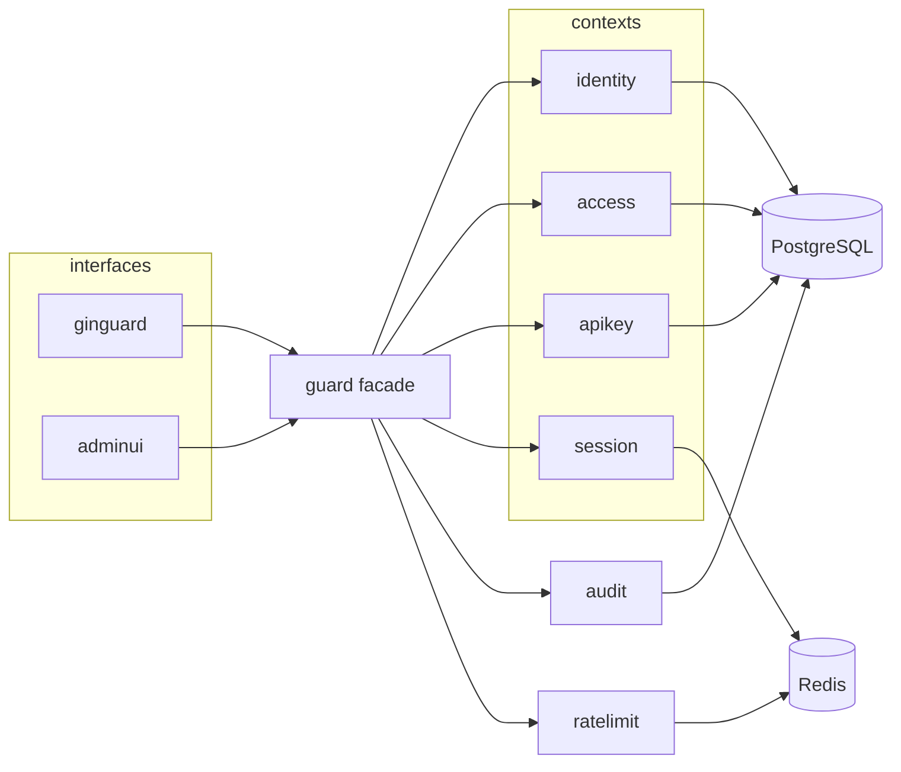
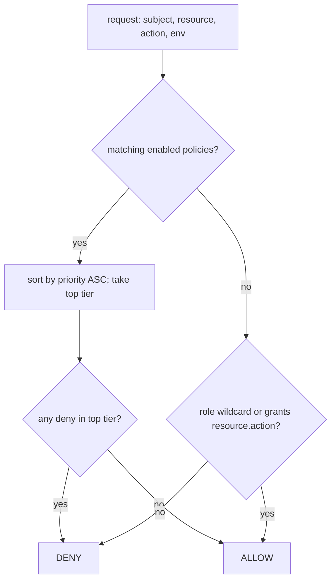
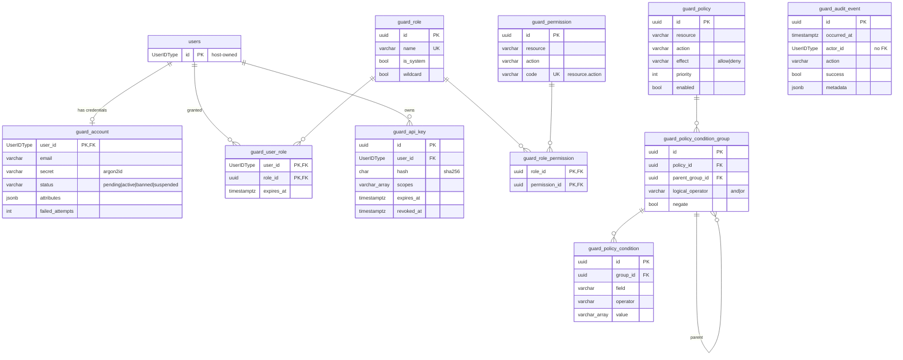

# Architecture

Guard is a library, not a service. The host application owns the HTTP server,
the user table and the database; Guard adds tables prefixed `guard_` that
reference the host user table, and stores sessions in Redis.

## Bounded contexts (DDD)

Dependencies point inward: `interfaces → application → domain`; `infrastructure`
implements domain repository interfaces.

| Context | domain | application | infrastructure |
|---|---|---|---|
| `identity` | account, email, status, lockout, password rules | register, authenticate, change/reset password | argon2id hasher, PostgreSQL (`guard_account`) |
| `session` | token (only SHA-256 id stored), idle/absolute timeout | start, resolve (sliding), revoke | Redis |
| `access` | role, permission `resource.action`, policy condition tree, `Decide` | authorize, role/permission/policy admin | PostgreSQL, in-memory |
| `apikey` | key, scopes, expiry, revocation | issue, resolve, revoke | PostgreSQL (`guard_api_key`), in-memory |

Supporting packages:

| Package | Role |
|---|---|
| `guard` (root) | Facade wiring the contexts: `New`, `Login`, `Authenticate`, `Authorize`, `CreateAccount`, `EnsureAdmin`, `Migrate` |
| `kernel/migrations` | Detects host `users.id` type; renders goose SQL templates; `Up`/`Down` (version table `guard_schema_version`) |
| `kernel/pgerr` | PostgreSQL error classification |
| `audit` | Append-only audit events (`guard_audit_event`) |
| `ratelimit` | Redis sliding-window limiter |
| `ginguard` | Gin interface layer: JSON API, middleware, error mapping |
| `adminui` | Server-rendered admin panel (`html/template`, CSRF-protected forms) |
| `guardtest` | In-memory Guard for host application tests |

## Request flow

1. Credential extraction (`ginguard`): `X-API-Key`, `Authorization: Bearer <session token | gk_...>`, or `guard_session` cookie.
2. Authentication: session token → Redis lookup by SHA-256 (sliding idle timeout, absolute cap); `gk_` key → `guard_api_key` by hash, rejected if expired/revoked.
3. Principal: account (must not be blocked), role grants (expired grants ignored), attributes. API keys act as their owner narrowed by scopes (`invoice.read`, `invoice.*`, `*`).
4. Authorization: `access/domain.Decide` (below). Result is audited where relevant.

## Decision algorithm

Source: `access/domain/access.go` `Decide`.

1. Load enabled policies whose `(resource, action)` matches the request (exact or `*`).
2. Keep policies whose condition tree holds (`and`/`or`, `negate`; operators `eq ne gt lt gte lte in not_in contains`; fields `user.*`, `resource.*`, `env.*`; values starting `$` dereference attributes, e.g. `$user.id`).
3. If any matched: sort by `priority` ascending (lower = stronger). Among policies with the **top** priority only, any `deny` → **deny**; otherwise **allow**. Weaker tiers are ignored.
4. If none matched: RBAC — allow if any role is `wildcard` or grants `resource.action`.
5. Otherwise **deny** (fail-closed).

Seeded data: roles `admin` (wildcard, system) and `user`; self-service read policies; `blocked user denied` (priority 10).

## Data model

`{{UserIDType}}` is detected from the host table (bigint, uuid, text, …). Guard never creates or alters the host user table.

Sessions (Redis, prefix `Config.RedisPrefix`, default `guard:`) are not in PostgreSQL.
